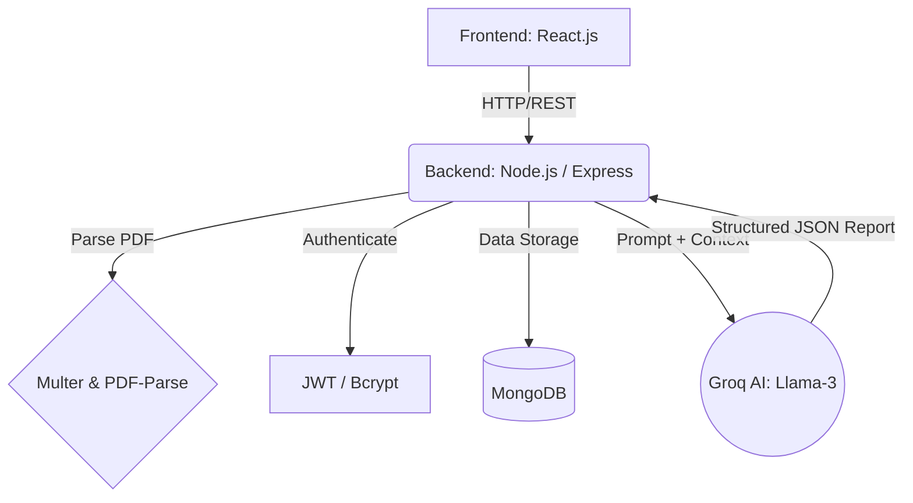

<div align="center">
  <h1> Career Assistant AI</h1>
  <p>An intelligent, generative AI-powered career coach that analyzes your resume against job descriptions to create personalized interview preparation plans.</p>
  
  
  
  
  
  
</div>

<br />

## ✨ Features

- 📄 **Resume Parsing**: Automatically extracts text from uploaded PDF resumes.
- 🎯 **Match Scoring**: Calculates an accuracy match score between your profile and the target job description.
- 💡 **AI Interview Questions**: Generates highly specific technical and behavioral questions (STAR method) tailored to the role.
- 🔍 **Skill Gap Analysis**: Identifies missing skills from your resume compared to the job description and rates their severity.
- 📅 **7-Day Roadmap**: Creates a daily, actionable preparation plan to bridge your skill gaps before the interview.
- 🔒 **Secure Authentication**: User accounts secured with JWT and bcrypt.
- 🎨 **Premium UI**: "Crimson Premium" sleek, glassmorphic dark-mode design.

---

## 🏗️ Project Architecture

This application follows a modern **MERN Stack** architecture, augmented with **Generative AI**.



---

## 🧠 Generative AI Integration (Groq & Llama-3)

This application transforms a standard Large Language Model (LLM) into a **deterministic, structured data generator** that acts as an expert Career Coach and Senior Technical Interviewer. 

Here is a deep dive into how Generative AI powers this platform:

### 1. The Inference Engine (Groq + Llama 3.3 70B)
Instead of traditional API providers, this project utilizes **Groq's LPU (Language Processing Unit)** via the `groq-sdk`. We specifically target the `llama-3.3-70b-versatile` model. 
- **Why this model?** The 70B parameter Llama 3.3 model provides near-GPT-4 levels of reasoning, which is critical for complex tasks like comparing resumes to job descriptions and formulating highly specific technical questions.
- **Why Groq?** Groq provides ultra-low latency, meaning the complex, multi-page interview report is generated in seconds rather than minutes.

### 2. Context Aggregation & Prompt Engineering
To generate accurate insights, the AI needs context. The backend aggregates unstructured data:
1. **Resume Text**: Extracted via `pdf-parse` from the user's uploaded PDF.
2. **Job Description**: Raw text pasted by the user.
3. **Self Description**: Additional context provided by the user.

These elements are injected into a highly optimized **System Prompt**. The prompt explicitly instructs the LLM to adopt the persona of a critical Senior Interviewer, avoiding generic advice and focusing strictly on the provided technologies.

### 3. Strict Schema Enforcement (Zod to JSON)
By default, LLMs return unpredictable markdown or plain text. To integrate AI seamlessly into a full-stack application, the output *must* be predictable.
- **Zod Schemas**: We define the exact shape of the response using `zod` in `ai.service.js` (e.g., arrays of questions, severity enums, numeric scores).
- **Zod-to-JSON-Schema**: This Zod schema is converted into a standard JSON schema and injected directly into the LLM's prompt.
- **JSON Mode**: We force Groq's API into JSON mode (`response_format: { type: "json_object" }`).

### 4. The AI Output Payload
Because of the strict schema enforcement, the AI returns a flawless, easily parseable JSON object containing:
- `matchScore`: A calculated percentage (0-100) reflecting candidate suitability.
- `technicalQuestions`: Highly specific questions, the *intention* behind them, and a model *answer*.
- `behavioralQuestions`: Soft-skill questions mapped to the STAR method.
- `skillGaps`: Identified missing technologies with assigned `severity` (low, medium, high).
- `preparationPlan`: A day-by-day, structured 7-day learning curriculum.

This structured JSON is instantly saved to **MongoDB** and parsed by the React frontend to build the interactive dashboard.

---

## 💻 Tech Stack & Libraries Used

### Frontend (Client-Side)
- **React.js**: Core UI library for building component-driven interfaces.
- **React Router DOM**: Handles page navigation (Home, Interview Report, etc.).
- **Axios**: Manages HTTP requests to the backend.
- **SCSS / Sass**: Used for modular, maintainable "glassmorphic" styling.
- **Context API**: Manages global application state (like the current user and loaded reports).

### Backend (Server-Side)
- **Node.js & Express.js**: The core server handling API routing and requests.
- **MongoDB & Mongoose**: NoSQL database and Object Data Modeling (ODM) for storing users and interview reports.
- **JSON Web Tokens (JWT)**: Used for stateless, secure user authentication and session management.
- **Bcrypt**: Hashes passwords securely before saving to the database.
- **Multer**: Middleware used to intercept and handle `multipart/form-data` (specifically, uploading PDF resumes directly to memory).
- **PDF-Parse (v1.1.1)**: Extracts raw text from the uploaded PDF buffers to feed to the AI.
- **Groq SDK**: Interacts with the Groq API for lightning-fast AI inference.
- **Zod**: Validates schemas and enforces JSON-structured outputs from the LLM.

---

## 🛠️ Step-by-Step Implementation Guide

### 1. Database & Authentication Setup
- **Mongoose Models**: Created `User` and `InterviewReport` schemas.
- **Auth Routes**: Implemented `/api/auth/register` and `/api/auth/login`.
- **JWT Middleware**: Created `auth.middleware.js` to verify tokens attached to cookies, protecting private routes.

### 2. File Upload & Parsing
- **Multer Setup**: Configured Multer to use `memoryStorage` and restrict files to `application/pdf`.
- **PDF Extraction**: In the interview controller, `req.file.buffer` is passed to `pdfParse()` to extract readable text from the resume.

### 3. AI Service Integration
- **Zod Schema**: Defined the exact shape of the interview report (Match Score, Skill Gaps, Roadmap).
- **Groq API**: Built `ai.service.js` to inject the user's data (Resume Text + Job Description) into a system prompt, requiring a `json_object` response matching the Zod schema.

### 4. Backend Controllers
- **Generate Report**: Receives the file, parses it, calls the Groq AI service, and saves the resulting JSON object as a new document in MongoDB.
- **Fetch Reports**: Controllers to retrieve a single report by ID or a list of past reports for the logged-in user.

### 5. Frontend UI & State
- **useInterview Hook**: A custom React hook wrapping the Context API to handle loading states, error catching, and API calls smoothly.
- **Dashboard UI**: Built an interactive layout with dynamic SCSS styling (e.g., color-coded match score rings based on the normalized percentage).

---

## 🚀 How to Run Locally

1. **Clone the repository**
2. **Install Dependencies**
   ```bash
   cd backend && npm install
   cd ../frontend && npm install
   ```
3. **Environment Variables**
   Create a `.env` file in the `backend` directory:
   ```env
   MONGO_URI=your_mongodb_connection_string
   JWT_SECRET=your_jwt_secret
   GROQ_API_KEY=your_groq_api_key
   ```
4. **Run the Application**
   ```bash
   # Terminal 1: Backend
   cd backend && npm run dev
   
   # Terminal 2: Frontend
   cd frontend && npm run dev
   ```

---
<div align="center">
  <p>satadru mondal</p>
</div>
